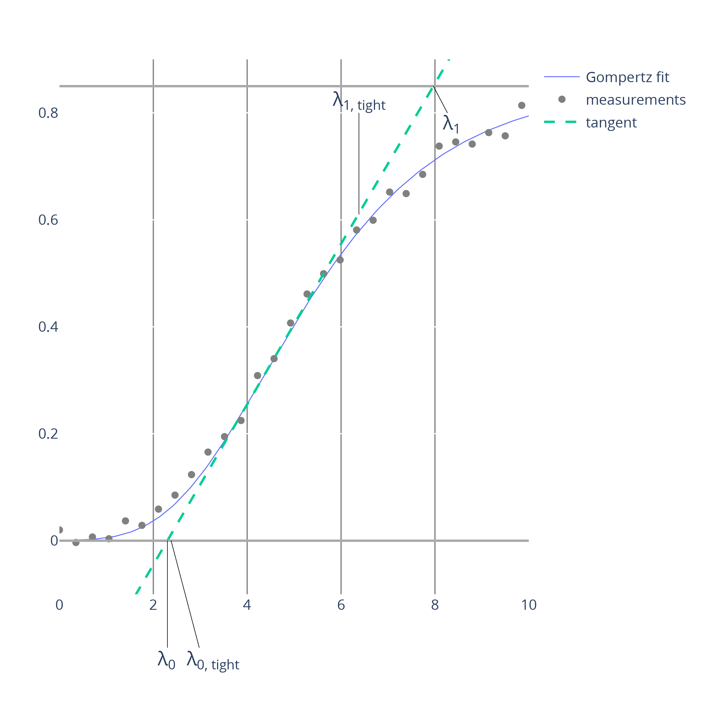

Dashing Growth Curves offers different methods to extract growth parameters from microbial growth curves.

# Growth Models
A variety of growth models for automatic growth curve fitting and growth parameter extraction are available.
The selection of models reflects their popularity in the literature[^1].
## Parametric
### 1. Logistic
This option fits all growth curves to the modified Logistic growth model[^2]:
$$y = \frac{A}{1 + \exp[\frac{4\mu_{max}}{A} (\lambda - t) + 2]}$$

Where:
- $N$: population size measure (can be optical density measurements, colony forming unit counts or similar)
- $y = log(N)$
- $A$: maximum population density.
- $\mu_{max}$: maximum growth rate.
- $\lambda$: lag time as defined by the x-axis intersect of the tangent at the inflection point of the growth model (see figure below).

### 2. Logistic - tight
This option fits the same model as described above, but uses a different definition of the lag time. Here, the lag time is the smallest zero of third derivative of the Logistic function. Generally, the 'tight' lag time is greater than the standard lag time (see figure below)[^3].
### 3. Gompertz
This option fits all growth curves to the modified Gompertz growth model[^1]:
$$y = \exp(-\exp( \frac{\mu_{max} \cdot e}{A} (\lambda - t) + 1))$$

The parameters are the same as for the logistic growth model.
### 4. Gompertz - tight
This option fits the same model as described above, but used the 'tight' definition of the lag time[^2].
### Lag time definitions

## Non-parametric
### Easy Linear
This option implements a heuristic algorithm to extract the maximum growth rate from log-linear segments of a growth curve similar to the method described by Hall et al.[^4]. 

Briefly, the algorithms is as follows:
1. Take the logarithm of the growth data
2. For all subsegments of the data of size $ws$ (the window size is defined by the user):
    - Fit a line through the datapoints of the subsegement
    - Record the slope which is equivalent to a growth rate estimate for this time interval
3. Determine the subsegment with maximum slope (i.e., highest growth rate). This segment defines the maximum achieved growth rate ($\mu_{max}$), the end of the lag phase and the end of the exponential phase.

# References
[^1]: [Ghenu et al., 2022](https://doi.org/10.1101/2022.06.24.497412)
[^2]: [Zwietering et al., 1990](https://doi.org/10.1128/aem.56.6.1875-1881.1990)
[^3]: [Zwietering et al., 1992](https://doi.org/10.1111/j.1365-2672.1992.tb01815.x)
[^4]: [Hall et al., 2014](https://doi.org/10.1093/molbev/mst187)
